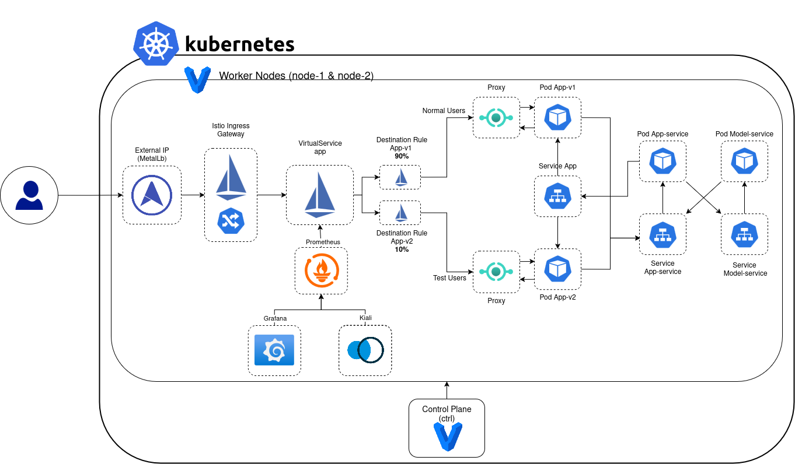

# REMLA Kubernetes Cluster Setup Guide

This README outlines the deployment structure and data flow and will also document how to provision and test a local multi-node Kubernetes cluster using Vagrant, Ansible, and kubectl for the REMLA team project.


## System Diagram

The deployment consists of microservices which are split across multiple repositories. Each have distinct functions and are deployed into a Kubernetes cluster. Traffic management is handled via Istio.



User requests enter through the **Istio Ingress Gateway**, which forwards them to a **VirtualService** that controls routing based on user headers. Traffic is then directed to either the `app-v1` or `app-v2` frontend deployments using **DestinationRules**:

* `app-v1` serves standard users.
* `app-v2` is used for testing user behavior with new features (e.g., A/B testing or canary releases).

Both versions are exposed through a single **Kubernetes Service (`app`)**, which abstracts over the versioned frontend Pods. These frontends communicate with the **`app-service`** backend through another Kubernetes Service. The backend then calls the **`model-service`**, which provides machine learning predictions or processing logic.

For monitoring, **Prometheus** scrapes metrics from services and Istio proxies. These metrics are visualized via **Grafana** dashboards and **Kiali**, offering observability into the mesh and service interactions.

(Diagram created using [draw.io](https://www.drawio.com/))

---

## Deployed Services

| Component | Source | Description |
|----------|-------------|-------------|
| `app-v1` / `app-v2` | [`app`](https://github.com/remla25-team11/app) | Frontend services served via `app` service and routed via Istio |
| `app-service` | [`app`](https://github.com/remla25-team11/app) | Backend logic that processes input and calls ML services |
| `model-service` | [`model-service`](https://github.com/remla25-team11/model-service) | Flask microservice providing ML predictions using `lib-ml` |
| `lib-ml` | [`lib-ml`](https://github.com/remla25-team11/lib-ml) | Preprocessing and utilities for training and inference |
| `model-training` | [`model-training`](https://github.com/remla25-team11/model-training) | Trains and exports models to `model-service` |
| `lib-version` | [`lib-version`](https://github.com/remla25-team11/lib-version) | Control library used by multiple components |


---

## Flow of Requests

1. **User Request → Istio Gateway**  
   External HTTP traffic enters via `istio-ingressgateway`.

2. **Gateway → VirtualService**  
   Istio routes requests based on HTTP headers:
   - `app-v1` (stable users)
   - `app-v2` (test users)

3. **Frontend → Service: app**  
   Both versions (`app-v1`, `app-v2`) are addressed by a single Kubernetes `Service`.

4. **Frontend → app-service**  
   The frontend calls the backend for application logic and data management.

5. **app-service → model-service**  
   The backend sends requests to the ML service (`model-service`) for inference.

6. **model-service → lib-ml**  
   Uses shared code from `lib-ml` to pre-process inputs and serve model outputs.

---

## Experimental Design

The following experiments can be done:
- **A/B testing**: Route based on custom headers using `VirtualService`.
- **Canary releases**: Gradually shift traffic from `app-v1` to `app-v2`.
- **Version feedback**: `lib-version` enables consistent version labeling across services.

---

## Running with Kubernetes

### Prerequisites

Before starting, make sure that minikube is running and that the Ingress addon is enabled

```bash
minikube start
minikube addons enable ingress
```

### Applying Kubernetes manifests

From the repository root (`operation/`) run:
```bash
kubectl apply -f k8s/
```

### Accessing the application

Find the minikube IP by running:
```bash
minikube ip
```

Then use that IP in your browser to access the application. 

#MacOS

Use a minikube tunnel and connect to the application using the localhost.

```
minikube tunnel
```

---
## Deploying with Helm Chart
Currently Helm is set to run on port 80. This can be changed in the values.yaml file.

### Prerequisites
- A running Kubernetes cluster
- kubectl configured
- Helm installed

### Deploying
In order to run the application to deploy the application using Helm do:
```bash
helm install <release-name> ./my_chart
```
To stop:
```bash
helm uninstall <release-name>
```

---

## Cluster Overview

* 1 control plane: `ctrl` @ 192.168.56.100
* 2+ worker nodes: `node-1`, `node-2`, ... @ 192.168.56.10X
* Base image: `bento/ubuntu-24.04`
* Networking: Host-only private network

---

## VM Management (Vagrant)

From the `operation/vagrant/` directory:

```bash
vagrant up                # Start with default 2 workers
NUM_WORKERS=3 vagrant up  # Start with custom number of workers
vagrant ssh ctrl          # SSH into controller
vagrant ssh node-1        # SSH into first worker
vagrant destroy -f        # Destroy all VMs
```

---

## Provision VMs with Ansible

From the `operation/` directory:

```bash
ansible-playbook -i ansible/inventory.cfg ansible/ctrl.yaml
ansible-playbook -i ansible/inventory.cfg ansible/node.yaml
```

The `node.yaml` playbook automatically handles the cluster join logic using:

* `delegate_to: ctrl` to run `kubeadm token create` on the controller
* `register: join_command` to capture the join command output
* `shell: "{{ join_command.stdout }}"` to run the command on each worker

If a node is already joined or needs a reset, you may need to manually clean it up (see README comments).

---

## SSH Key Registration (Team Access)

1. Place public keys in `ansible/ssh_keys/`, e.g.:

```bash
cp ~/.ssh/id_rsa.pub ansible/ssh_keys/sowmya.pub
```

2. Run the key registration playbook:

```bash
ansible-playbook -i ansible/inventory.cfg ansible/general.yaml
```

3. Teammates can then connect via SSH:

```bash
ssh -i ~/.ssh/id_rsa vagrant@192.168.56.101
```

---

## kubectl Setup (on Host)

1. Apply Flannel CNI:

```bash
kubectl apply -f https://raw.githubusercontent.com/coreos/flannel/master/Documentation/kube-flannel.yml
```

2. Set the kubeconfig path:

```bash
export KUBECONFIG=./vagrant/admin.conf
```

3. Test cluster connectivity:

```bash
kubectl get nodes
```

---

## Deploy a Sample App

```bash
kubectl create deployment hello-nginx --image=nginx
kubectl expose deployment hello-nginx --type=NodePort --port=80
kubectl get services
```

Visit the service at:

```
http://192.168.56.101:<NodePort>
```

## Install Prometheus

```bash
helm repo add prometheus-community https://prometheus-community.github.io/helm-charts
helm repo update

kubectl create namespace monitoring
helm install prometheus prometheus-community/kube-prometheus-stack -n monitoring
```

## Accessing Prometheus

```bash
kubectl port-forward svc/prometheus-operated -n monitoring 9090
```

Open the dashboard at:

```bash
http://localhost:9090/targets
```

## Grafana Dashboard

Start port-forwarding Grafana:

```bash
kubectl port-forward svc/prometheus-grafana 3000:80 -n monitoring
```

Open browser at:

```bash
http://localhost:3000
```

To retrieve credentials:

```bash
kubectl get secret prometheus-grafana -n monitoring -o jsonpath="{.data.admin-password}" | base64 --decode
```

Go to Dashboards → Manage, and open the pre-installed dashboard named "Dashboard"

# Manual Import 

To import the dashboard:

1. Run:

   ```bash
   kubectl port-forward svc/prometheus-grafana 3000:80 -n monitoring
    ```
Go to http://localhost:3000 and log in.

Navigate to Dashboards → Import.

Upload grafana/dashboards/app-dashboard.json.

## Select Prometheus as the data source and click Import.


## Sticky Sessions Istio

#### Prerequisites

Make sure you have:

1. Istio installed (if not):

   ```bash
   istioctl install --set profile=demo -y
   ```
2. Sidecar injection enabled:

```bash
kubectl label namespace default istio-injection=enabled
```
3. Apply Gateway, VirtualService, DestinationRule:

   ```bash
   kubectl apply -f k8s/istio-gateway.yaml
   kubectl apply -f k8s/virtual-service-app.yaml
   kubectl apply -f k8s/destination-rule-app.yaml
   ```

## If you are on macOS or using Minikube, run:

```bash
kubectl port-forward -n istio-system svc/istio-ingressgateway 8080:80
```

### Always routes to app v2

```bash
curl -H "user: test-user" http://localhost:8080/version
```

### Always routes to app v1
```bash
curl http://localhost:8080/version
```

---

## Additional Use Case

### Rate Limit Setup

This project includes a configurable rate limiting mechanism for the app service, using Istio's EnvoyFilter and managed via Helm. Rate limiting is applied per version of the app (app-v1, app-v2) through local rate limiting at the Istio sidecar proxy level. 

Ensure you are in /operation directory

```bash
minikube start --memory=4096 --cpus=4 --driver=docker 
minikube addons enable ingress
```
Istio installed (if not):

```bash
istioctl install --set profile=demo -y
```
Sidecar injection enabled:

```bash
kubectl label namespace default istio-injection=enabled
```

```bash
helm repo add prometheus-community https://prometheus-community.github.io/helm-charts
helm repo update
helm install kube-prometheus-stack prometheus-community/kube-prometheus-stack -n monitoring --create-namespace
```

```bash
kubectl apply -f k8s/
```

### Install App Versions via Helm

You can change the limit by overriding the default values

```bash 
helm install app-v1 ./my-chart \
  --set appVersion=v1 \
  --set rateLimit.enabled=true \
  --set rateLimit.maxTokens=2 \
  --set rateLimit.tokensPerFill=2 \
  --set rateLimit.fillInterval=10s

```

```bash 
helm install app-v2 ./my-chart \
  --set appVersion=v2 \
  --set rateLimit.enabled=true \
  --set rateLimit.maxTokens=5 \
  --set rateLimit.tokensPerFill=5 \
  --set rateLimit.fillInterval=10s
```

### Test the Rate Limiting 

```bash 
minikube ip
```
use this ip for the bellow command

### Test app-v1 (default routing, no header)
``` bash 
for i in {1..10}; do
  echo -n "v1 Request $i: "
  curl -s -o /dev/null -w "%{http_code}\n" http://{minikube-ip}/
  sleep 1
done
```
### Test app-v2 (header-based routing to v2)
``` bash 
for i in {1..10}; do
  echo -n "v2 Request $i: "
  curl -s -o /dev/null -w "%{http_code}\n" -H "user: test-user" http://{minikube-ip}/
  sleep 1
done
```

you should see a response like :

HTTP/1.1 429 Too Many Requests
x-rate-limit: true

Additionally, you can run the below command to see active envoyfilters 
```bash
kubectl get envoyfilter
```


### Uninstall the app after testing

```bash
helm uninstall app-v1
helm uninstall app-v2
```


## Extra use case - shadow launch 

```bash
minikube start --memory=4096 --cpus=4 --driver=docker 
minikube addons enable ingress
```
Istio installed (if not):

```bash
istioctl install --set profile=demo -y
```
Sidecar injection enabled:

```bash
kubectl label namespace default istio-injection=enabled
```

```bash
helm repo add prometheus-community https://prometheus-community.github.io/helm-charts
helm repo update
helm install kube-prometheus-stack prometheus-community/kube-prometheus-stack -n monitoring --create-namespace
```

```bash
kubectl apply -f k8s/
```

To find node-port value 

```bash
kubectl get svc istio-ingressgateway -n istio-system
```
```
NAME                   TYPE           CLUSTER-IP      EXTERNAL-IP   PORT(S)                                                                      AGE
istio-ingressgateway   LoadBalancer   10.96.177.123   <pending>     15021:30852/TCP,80:30814/TCP,443:30633/TCP,31400:32202/TCP,15443:30670/TCP   2m35s
```

(30814 is the nodeport here) 

```bash
 curl -X POST http://{minikube-ip}:{node-port}/predict -H "Content-Type: application/json" -d '{"review": "Good food!"}
```

To check metrics  

```bash
kubectl port-forward deploy/model-service-v3 9001:8000
```

Open new terminal 

```bash
curl http://localhost:9001/metrics
```

should be able to see the counter update for every time predict is called

```
# TYPE predict_requests_total counter
predict_requests_total{version="v3"} 2.0
# HELP predict_requests_created Total number of /predict requests
# TYPE predict_requests_created gauge
predict_requests_created{version="v3"} 1.7495915754185112e+09
```
